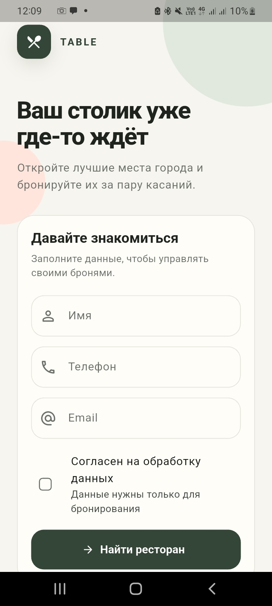
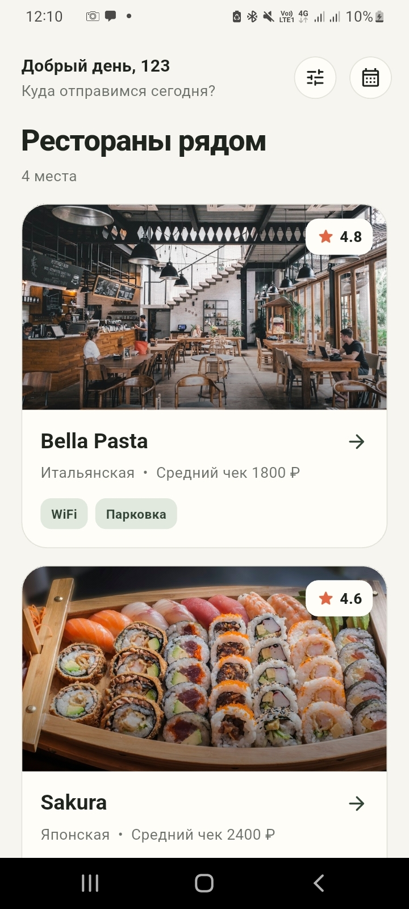
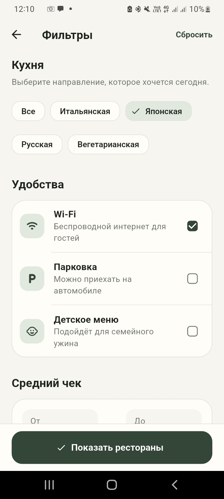
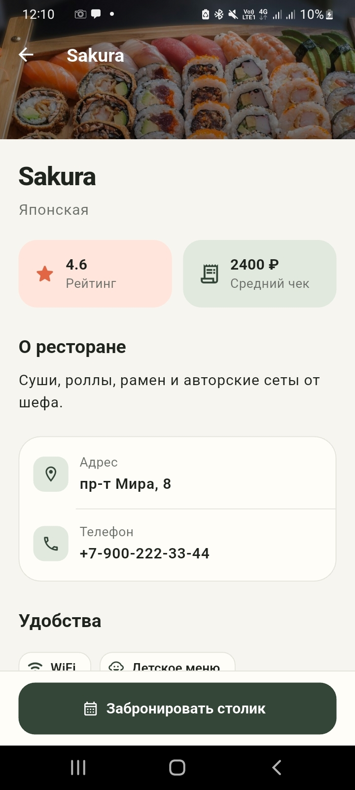
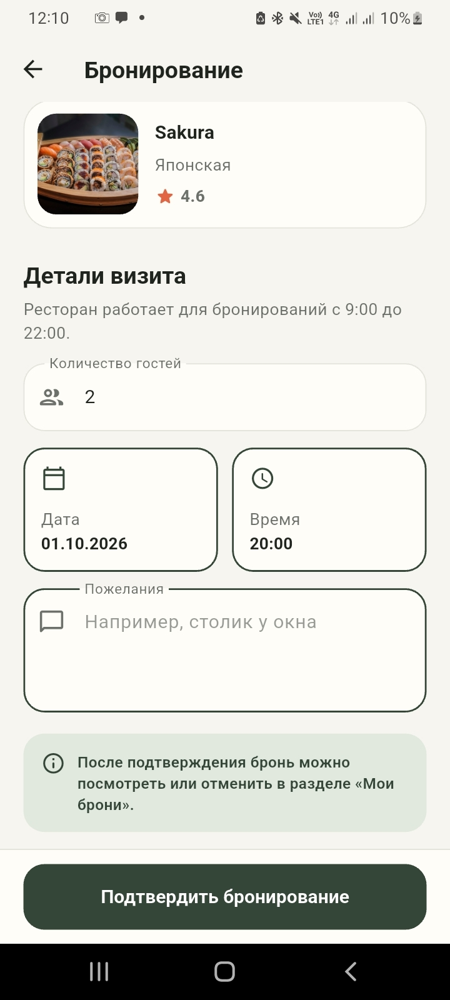
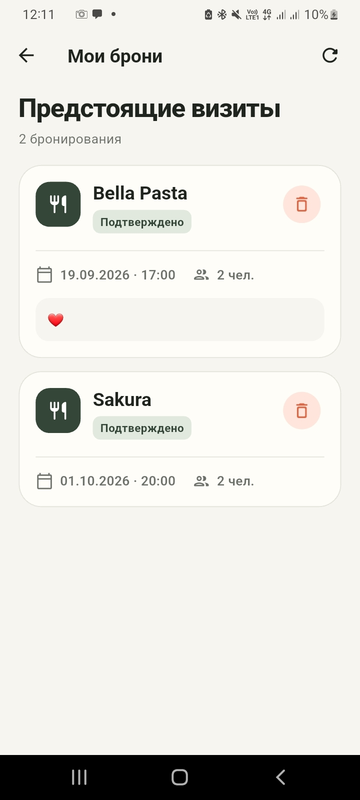

# Ресторанный гид (Restaurant Guide)

Мобильное приложение на Flutter для поиска ресторанов, просмотра детальной информации и бронирования столиков. Данные загружаются с удалённого REST API, а брони сохраняются на сервере.

## Интерфейс приложения

<p align="center">
  
  
  
</p>

<p align="center">
  
  
  
</p>

## Функциональность

- **Регистрация пользователя**  
  Ввод имени, телефона (в формате `+7-XXX-XXX-XX-XX`) и email, обязательное согласие на обработку данных.  
  ID пользователя сохраняется в `SharedPreferences` для автоматической авторизации при следующем запуске.

- **Список ресторанов**  
  Отображаются карточки с фото, названием, кухней, рейтингом и средним чеком.  
  Поддерживается:
  - Фильтрация по кухне, дополнительным услугам (WiFi, парковка, детское меню) и диапазону среднего чека.
  - Обновление списка (pull-to-refresh или кнопка обновления).
  - Переход на экран деталей ресторана.

- **Детальная страница ресторана**  
  Показывает фото, описание, адрес, телефон, список удобств (фичи) и примеры отзывов (статические).  
  Кнопка «Забронировать столик» открывает экран бронирования.

- **Бронирование столика**  
  Выбор даты и времени (доступно с 9:00 до 22:00), количество персон, комментарий.  
  После успешного создания брони появляется анимационный диалог, а бронь сохраняется на сервере.

- **Мои бронирования**  
  Список всех броней текущего пользователя с возможностью удаления (с подтверждением).

- **Работа с реальным API**  
  Все запросы (получение ресторанов, создание/получение/удаление броней) идут через HTTP-клиент к бэкенду, URL которого задаётся в `.env`.

## Технологии

- **Flutter** (Material Design 3)
- **Dart**
- **http** — для сетевых запросов
- **shared_preferences** — для хранения ID пользователя
- **flutter_dotenv** — для загрузки переменных окружения

## Требования

- Flutter SDK (≥ 3.0)
- Android / iOS / Web (поддерживаются все платформы)
- Доступ к работающему бэкенду с эндпоинтами (см. раздел API)

## Установка и запуск

Клонируйте репозиторий:
   ```bash
   git clone https://github.com/nastya137/restaraunt_guide_flutter.git
   cd restaraunt_guide_flutter
  ```

Установите зависимости:
  ```bash
  flutter pub get
  ```

Создайте файл .env в корне проекта и укажите базовый URL вашего API:
  ```bash
  BASE_URL=http://ваш-сервер:порт
  ```

Запустите приложение:
  ```bash
  flutter run
  ```
